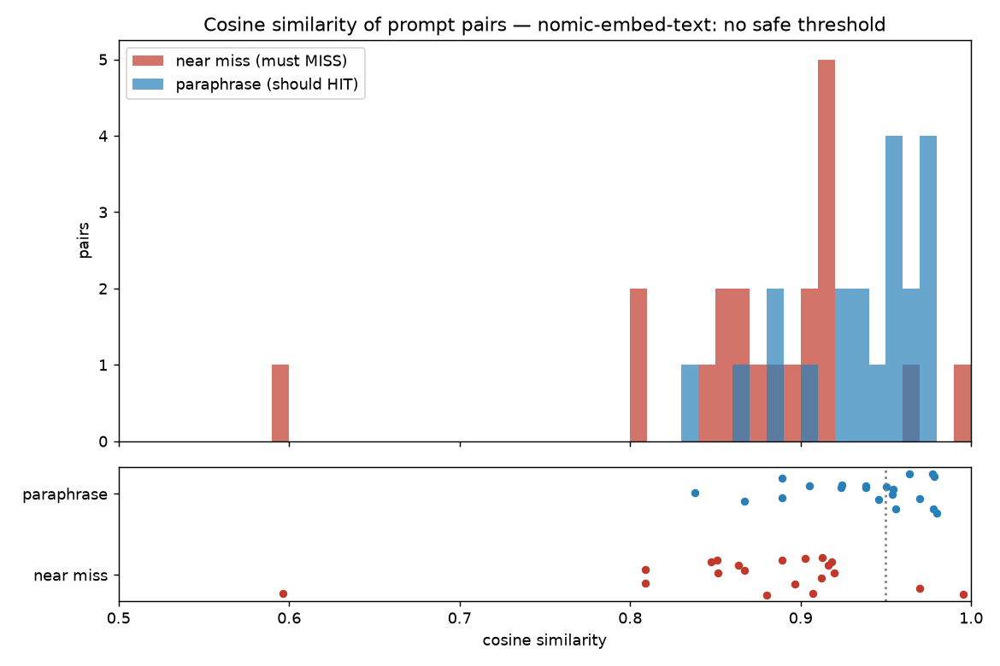
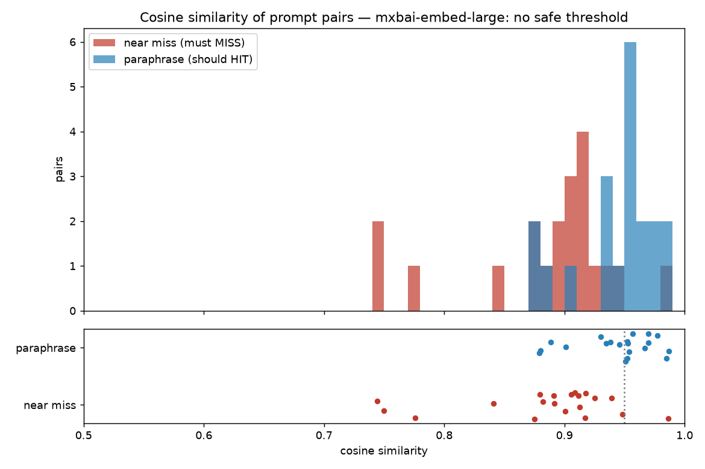

# vortex-ai-gateway

**v0.3**

## What is This?

vortex-ai-gateway is an AI Gateway designed to serve as a unified control plane and routing hub for AI model interactions. It manages request flow, handles authentication, orchestrates model selection, and provides a centralized entry point for AI applications.

[`docs/architecture.md`](docs/architecture.md) walks one request through every
layer — auth, limits, cache, routing, resilience, adapter — with the decision
behind each and the condition under which it was the wrong one.

## About the Name

**Vortex** — A vortex represents a center of concentrated activity and convergence. In fluid dynamics, a vortex is where multiple flows merge into a cohesive center. We chose this name because a gateway should act as a convergence point—drawing together multiple AI requests, models, and services, then directing them intelligently through a unified system.

**AI Gateway** — Self-explanatory. A gateway in networking and systems design controls and directs traffic between different domains. An AI Gateway specifically manages traffic and interactions with artificial intelligence systems.

Together, **vortex-ai-gateway** evokes both the convergence point metaphor and the explicit purpose of the system.

## Getting Started

This project uses [uv](https://docs.astral.sh/uv/) for dependency management.
Python 3.14 is pinned in `.python-version`.

### Installation

```bash
# Creates the virtualenv, installs the project and dev tooling from uv.lock
uv sync
```

### Configuration

Settings load from environment variables prefixed `VORTEX_` (see
`vortex_ai_gateway.config.Settings`). For local development, copy the template
and edit as needed — `.env` is git-ignored and read automatically:

```bash
cp .env.example .env
```

Every setting has a default, so the app also runs with no `.env` at all. A real
environment variable always overrides a line in `.env`.

### Provider routing

Which vendor serves which model is one ordered, comma-separated table. First
match wins, so a specific rule may precede a general one, and patterns are
shell globs:

```bash
VORTEX_MODEL_ROUTES=gpt-4o=openai,gpt-*=openai,claude-*=anthropic,local/*=ollama
VORTEX_OPENAI_API_KEY=sk-...
VORTEX_ANTHROPIC_API_KEY=sk-ant-...
```

The table is also the enable list. Only the providers it names are constructed;
one that is named without its key stops the gateway at startup rather than on
the first request that routes there; and a model no rule claims is rejected with
a `404`, unless `VORTEX_DEFAULT_PROVIDER` says where to send it. Leave the table
empty — the default — and the gateway answers from its built-in mock provider,
loudly, so a keyless checkout still works end to end.

Callers keep using the OpenAI wire format throughout: the model name in the
request body is what selects the provider, and the response names the one that
served it under `vortex.provider`.

Two timeouts, not one: `VORTEX_REQUEST_TIMEOUT_SECONDS` (default 30) budgets the
*answer*, and `VORTEX_CONNECT_TIMEOUT_SECONDS` (default 5) budgets the
connection. They are separate because sharing a number lets an unreachable host
hold a worker for the full generation window — measured in
[`docs/notes/day-04.md`](docs/notes/day-04.md).

### Streaming

Set `"stream": true` and the reply is server-sent events in OpenAI's framing —
`data: {chunk}` per event, terminated by `data: [DONE]`. `examples/stream.sh`
renders the tokens as they land:

```bash
uv run uvicorn vortex_ai_gateway.gateway:app | tee gateway.log   # in one shell
examples/stream.sh "write a haiku about latency"                 # in another
examples/stream.sh --abandon 2                                   # hang up mid-stream
```

Two things happen behind that stream that a plain relay would not do.

**Every stream is accounted for, whether or not the caller asked.** Token counts
arrive in a final chunk providers only send when `stream_options.include_usage`
was set, so the gateway always sets it and strips the chunk back out when the
caller did not ask for it. The caller sees exactly the OpenAI-compatible stream
they expect; the gateway still gets the bill, as one log line per request:

```json
{"event": "stream finished", "outcome": "completed", "provider": "openai",
 "model": "fake-model", "upstream_model": "fake-model", "chunks": 13,
 "prompt_tokens": 7, "completion_tokens": 12, "total_tokens": 19}
```

**Hanging up stops the meter.** When a client disconnects mid-generation the
cancellation is carried into the provider's stream, which closes the upstream
connection rather than leaving it generating tokens nobody will read. The
request is recorded as `"outcome": "abandoned"` at warning level — an access log
cannot tell that case from a stream that simply finished quickly, and it is the
one that costs money with nothing to show for it. See ADR-018 and ADR-019.

### Running the Application

```bash
uv run uvicorn vortex_ai_gateway.gateway:app --reload
```

The server will be available at `http://localhost:8000`

### Logging

Logs are emitted as one JSON object per line on stdout (structlog); pipe through
`jq` in development. Every request is assigned a request ID — taken from an
inbound `X-Request-ID` header or generated — which is attached to every log line
for that request, returned in the `X-Request-ID` response header, and available
to handlers as `request.state.request_id`. `VORTEX_LOG_LEVEL` sets the
threshold.

### Development

```bash
uv run pytest            # tests with coverage
uv run ruff check src tests   # lint
uv run ruff format src tests  # format
uv run mypy src          # strict type check

uv run pre-commit install    # enable hooks on commit
uv run pre-commit run --all-files
```

## Project Layout

```
src/vortex_ai_gateway/    # the package (src/ layout, not flat)
tests/                    # imports the installed package, never src/
scripts/                  # one-off experiments and load generators
bench/                    # k6 workloads, the matrix runner, the report (see Benchmarks)
docs/design|adr|notes/    # the paper trail: before, decided, after
deploy/                   # Prometheus config, Grafana provisioning, the dashboard JSON
compose.yaml, Dockerfile  # the reference stack (see Observability)
```

The `src/` layout is deliberate. Tests import `vortex_ai_gateway` from the
installed distribution rather than from the working directory, so a packaging
mistake — a module missing from the wheel, a bad `pyproject.toml` — fails the
test run instead of being masked by Python finding the source tree first.
CI enforces this by installing a built wheel (`uv sync --no-editable`), and
the pytest config deliberately sets no `pythonpath`.

## CI/CD

Every push and pull request runs, in order:

| Stage | Command |
|-------|---------|
| Install | `uv sync --locked --no-editable` |
| Lint | `ruff check src tests` |
| Format | `ruff format --check src tests` |
| Types | `mypy src` (strict) |
| Tests | `pytest -v` |

`--locked` fails the build if `uv.lock` is out of step with `pyproject.toml`,
so dependency changes cannot land without a matching lockfile update.

The `main` branch requires these checks to pass and a pull request review.

## License

Licensed under the Apache License 2.0. See LICENSE file for details.

## Resilience

Every provider gets its own retry loop and its own circuit breaker, so one
vendor's outage cannot stop another's traffic. Failures are classified by the
taxonomy in `providers/errors.py`: transient ones are retried with full jitter
inside a wall-clock deadline, a `429` waits exactly as long as the provider
asked, and a `400` is never retried and never counts against the breaker.

```bash
VORTEX_MODEL_ROUTES=gpt-*=openai,claude-*=anthropic
VORTEX_FALLBACK_CHAINS=openai>anthropic     # hop when openai's breaker is open
VORTEX_RETRY_MAX_ATTEMPTS=3
VORTEX_RETRY_DEADLINE_SECONDS=90            # must exceed the request timeout
VORTEX_BREAKER_FAILURE_THRESHOLD=5          # failed requests, not attempts
```

Retries, breaker transitions and fallback hops each emit one JSON log event
carrying the request ID, so `event:"provider fallback"` is a single query. See
ADR-001, ADR-002 and ADR-020 for the decisions behind the defaults.

## API keys

Keys live hashed in SQLite and are minted by a CLI, not an endpoint — creating
the *first* credential over an authenticated API is a bootstrapping problem
whose usual answer is a bootstrap secret, which is the plaintext key we were
trying to get rid of (ADR-003).

```bash
export VORTEX_KEY_DB_PATH=/var/lib/vortex/keys.sqlite3

uv run vortex-keys create --name ci-pipeline --rpm 600 --tpm 150000
# vtx_9f2c41ab77de_qtZ8...  ← shown once; only the SHA-256 is stored
uv run vortex-keys list
uv run vortex-keys revoke 9f2c41ab77de     # effective on the next request
```

A token is `vtx_<key_id>_<secret>`. The `key_id` is public: it is what you
revoke by, what appears in logs, and what a rate limit and a bill hang off. The
secret is 32 CSPRNG bytes hashed with SHA-256 — not bcrypt, because a work
factor exists to make *guessable* secrets expensive to guess and there is no
dictionary behind 256 random bits, so it would buy nothing and cost ~100 ms of
CPU on every request.

With `VORTEX_KEY_DB_PATH` set, the plaintext `VORTEX_API_KEYS` list is ignored
rather than merged: two allow-lists means revoking from one and still being let
in by the other.

## Rate limits and usage

Each key gets a requests-per-minute and a tokens-per-minute allowance, held as
token buckets in Redis and checked in a single Lua script — a request refused by
the token bucket must not have already spent a request (ADR-021).

```bash
VORTEX_METERING_ENABLED=true
VORTEX_REDIS_URL=redis://localhost:6379/0
VORTEX_RATE_LIMIT_DEFAULT_RPM=60            # for keys with no limit of their own
VORTEX_RATE_LIMIT_DEFAULT_TPM=90000         # 0 means unlimited
VORTEX_RATE_LIMIT_ASSUMED_COMPLETION_TOKENS=512
```

Every response carries its remaining allowance, not just the rejections, so a
client can slow down *before* it is throttled:

```
x-ratelimit-limit-requests: 60      x-ratelimit-limit-tokens: 90000
x-ratelimit-remaining-requests: 59  x-ratelimit-remaining-tokens: 89498
x-ratelimit-reset-requests: 1.0s    x-ratelimit-reset-tokens: 0.3s
```

A rejection is a `429` with `Retry-After` and `"code": "gateway_rate_limit_exceeded"`,
which is how it is told apart from a `429` relayed from a vendor — one means a
client is sending too much, the other means our own account is throttled.

Because a request's token cost is unknown until the provider answers, admission
reserves an estimate and settlement reconciles it against real usage. Redis
being unreachable **fails open** with one warning, and Redis is deliberately not
a readiness check: draining a working instance because the limiter is degraded
would turn a degradation into an outage.

`GET /v1/usage` reports the calling key's own spend, priced from a table you can
override without a release:

```bash
curl -H "Authorization: Bearer $KEY" localhost:8000/v1/usage?days=7
```

```json
{"object": "usage.report", "key_id": "9f2c41ab77de",
 "total_requests": 5, "total_unmetered_requests": 0, "total_tokens": 35,
 "total_cost_usd": "0.0000165", "unpriced_models": [], "daily": [...]}
```

The ledger stores **token counts**, never money: `HINCRBY` is exact, and pricing
at read time means a corrected price corrects the history rather than needing a
migration. Costs come back as JSON *strings* so they survive a round trip
through a parser that would otherwise make them floats. A model the table cannot
price reports `null`, never zero, and names itself in `unpriced_models` — and a
request whose usage never arrived (an abandoned stream) is counted as
*unmetered* rather than as free. `VORTEX_PRICE_TABLE_PATH` points at
`{"gpt-4o": {"prompt": 2.5, "completion": 10.0}}` in USD per million tokens; it
is consulted before the built-in table, so it need only name what it corrects.
See ADR-022.

## Response cache

Two tiers, cheap one first. The **exact** tier is a SHA-256 over the validated
request (sorted keys, minus the fields that cannot change a generated token),
namespaced per API key so one tenant's completion is never served to another;
a hit is a Redis `GET` and is settled at zero tokens. The **semantic** tier is
asked only when the exact tier *looked and missed* — never when it bypassed —
because an embedding is a network call and a hash is not. Only `messages` is
embedded; everything else is hashed into the namespace the vector is searched
in, so the threshold is about wording alone. A semantic hit is promoted into
the exact tier, so the next identical request costs a hash, not an embedding.
Streams bypass both. See ADR-004 and ADR-024.

```bash
VORTEX_CACHE_ENABLED=true
VORTEX_CACHE_TTL_SECONDS=300
VORTEX_CACHE_TTLS=/v1/chat/completions=600   # per route; 0 means never cache
VORTEX_CACHE_SCOPE=key                       # or global, single-tenant only
VORTEX_SEMANTIC_CACHE_ENABLED=false          # see below for why
VORTEX_SEMANTIC_CACHE_THRESHOLD=0.95
VORTEX_EMBEDDING_MODEL=                      # an Ollama model name; empty = no embedder
VORTEX_EMBEDDING_BASE_URL=                   # falls back to VORTEX_OLLAMA_BASE_URL
```

Every response says which tier answered — `X-Cache: HIT|MISS|BYPASS`, and
`X-Semantic-Cache` with `X-Semantic-Cache-Score` carrying the nearest cosine
on misses too. That score distribution is the evidence for moving the
threshold. `X-Vortex-Cache-Bypass: true` on a request skips lookup *and* store,
so debugging the cache cannot change what is in it.

### Why the semantic tier is off by default

The threshold was measured, not guessed: `scripts/threshold_experiment.py`
embeds 20 paraphrase pairs (should HIT) and 20 hard near-miss pairs — one
changed number, a swapped unit, an antonym — that must MISS, and picks the
threshold under one rule: **no near miss may clear it**. With both local
embedders tried, no threshold does.





| model | paraphrase min / median | near-miss median / **max** | at 0.95: false hits / false misses | safe threshold |
|---|---|---|---|---|
| `nomic-embed-text` | 0.838 / 0.948 | 0.893 / **0.996** | 2/20 / 10/20 | none |
| `mxbai-embed-large` | 0.879 / 0.952 | 0.903 / **0.986** | 1/20 / 8/20 | none |

The worst near miss — *Convert 5 miles to kilometres* vs *Convert 5 kilometres
to miles*, 0.996 — outscores the best genuine paraphrase. Cosine over a
sentence embedding measures what a text is *about*, and those two are about
the same thing; a cache serves answers, and theirs differ. So the tier ships
as tested plumbing with a documented reason not to enable it (ADR-005).
Enabling it is a procedure, not a flag: pull a model, run the script, set the
threshold it prints, and re-run on every model change.

```bash
ollama pull nomic-embed-text
uv run python scripts/threshold_experiment.py --model nomic-embed-text --url http://localhost:11434
VORTEX_SEMANTIC_CACHE_ENABLED=true VORTEX_EMBEDDING_MODEL=nomic-embed-text \
  uv run uvicorn vortex_ai_gateway.gateway:app
```

The embedder is `embedding.py`, its own seam rather than a chat adapter
(ADR-025). With it on, the two-tier path reads back in the headers:

```
"What's the capital of France?"   X-Cache: MISS  X-Semantic-Cache: MISS
"capital city of France?"         X-Cache: MISS  X-Semantic-Cache: HIT   X-Semantic-Cache-Score: 0.9658
"capital city of France?"         X-Cache: HIT   X-Semantic-Cache: BYPASS
```

— and so does the false hit the plot predicts: *Convert 5 kilometres to miles*
is served the answer to *Convert 5 miles to kilometres* at 0.9955.

Raw scores are in `docs/notes/threshold-<model>.json`; the write-up is
`docs/notes/day-10.md`.

## Observability

Three things, in one stack: a trace per request, a Prometheus endpoint, and a
dashboard committed as a file.

```bash
docker compose up -d                       # gateway + redis + prometheus + grafana
uv run python scripts/generate_traffic.py  # put something on it
open http://localhost:3000                 # Grafana, anonymous, dashboard already there
```

| | |
|---|---|
| Gateway | <http://localhost:8000/metrics> |
| Prometheus | <http://localhost:9090> |
| Grafana | <http://localhost:3000> — dashboard **Vortex / Vortex AI Gateway** |
| Jaeger | <http://localhost:16686> — `VORTEX_TRACING_ENABLED=true docker compose --profile tracing up -d` |

Nothing in that stack is a production default: Grafana has authentication off,
Redis has no password, and the gateway runs on its mock provider so the whole
thing comes up with no vendor keys and no bill.

### Metrics

`/metrics` is served **open**, beside `/healthz` and `/readyz` rather than under
`/v1`, because a scraper has no API key and issuing it one puts a credential
that can read your traffic volumes into a monitoring system's config file
(ADR-028). It publishes counts, latencies and totals — never a prompt, a
completion, or a key. A gateway exposed directly to the internet should set
`VORTEX_METRICS_ENABLED=false` and scrape a sidecar.

| Metric | What it answers |
|---|---|
| `vortex_requests_total{route,method,status,model,provider}` | traffic, error rate, model mix |
| `vortex_request_duration_seconds` | latency quantiles, by route and model |
| `vortex_stream_ttft_seconds` | time to first token — streams only |
| `vortex_cache_lookups_total{tier,outcome}` | hit rate per tier, bypasses excluded |
| `vortex_provider_attempts_total{provider,outcome}` | upstream calls per request served |
| `vortex_provider_retries_total`, `..._give_ups_total{reason}` | the retry storm, and how it ended |
| `vortex_fallbacks_total`, `vortex_breaker_transitions_total`, `vortex_breaker_state` | what failed over, and what is refusing traffic now |
| `vortex_streams_total{outcome}` | completed / failed / **abandoned** |
| `vortex_tokens_total{model,kind}`, `vortex_cost_usd_total{model}` | what it cost |

The numbers are per **worker process**, like the circuit breaker's state and
both caches' counters. Run one worker per port and scale with containers.

**`model` is capped.** It comes out of a request body, and a Prometheus label
value allocates a series that lives until the process exits — so the gateway
admits `VORTEX_METRICS_LABEL_BUDGET` distinct values (50 by default) and reports
everything after that as `other` (ADR-027). Seeing `other` on a dashboard means
raise the budget. `route` is the matched route *template*, never the path as
sent, so a scanner guessing URLs allocates one series and not one per guess.

### Tracing

Off by default, and off costs one `is None` test per span. That is something
`span()` does on purpose, not a property of OpenTelemetry. A no-op *tracer*
still builds generator context managers on every span, which measured at 16% of
a request until `span()` learned to return one shared inert context manager
when no provider is installed (ADR-029, and [Benchmarks](#benchmarks)).

```bash
VORTEX_TRACING_ENABLED=true VORTEX_TRACING_EXPORTER=console \
  uv run uvicorn vortex_ai_gateway.gateway:app
```

One trace per request, branching at the four things worth timing separately.
This is a real trace from a gateway pointed at a dead upstream, with
`VORTEX_RETRY_MAX_ATTEMPTS=3`:

```
POST /v1/chat/completions            ERROR  status=502  model=gpt-4o-mini  provider=router
├─ cache.exact.lookup                       tier=exact     outcome=off
├─ cache.semantic.lookup                    tier=semantic  outcome=off
└─ provider.complete                 ERROR  provider=router  model=gpt-4o-mini
   ├─ provider.attempt               ERROR  attempt=1 of 3
   ├─ provider.attempt               ERROR  attempt=2 of 3
   └─ provider.attempt               ERROR  attempt=3 of 3
```

That is the retry storm as a shape rather than as three log lines nobody
joined. Every log line the request emits carries `trace_id` and `span_id`, so a
line copied out of the logs pastes straight into Jaeger:

```json
{"event": "request completed", "http_status": 502, "duration_ms": 349.1,
 "request_id": "1072374a1ca4473f815e7e1803a2402a",
 "trace_id": "2197d057837046a1545a96477e00b693", "span_id": "79c00601d3bbee17"}
```

Spans are written by hand rather than installed by
`opentelemetry-instrumentation-fastapi`, because that installs itself in the
`BaseHTTPMiddleware` shape this codebase already refuses — it breaks streaming,
and streaming with a correct ending taxonomy is the most carefully built thing
here (ADR-026).

### Generating traffic

`scripts/generate_traffic.py` sends a deliberate *mix* — repeats so the cache
has something to hit, several models so the breakdowns have series, streams so
TTFT has a source, and a few bad requests so the error panel is a working error
panel — then reads the result back out of `/metrics`. A real run, 600 requests
against the mock provider with Redis and the exact cache on:

```
  sent 600 requests in 1.3s (477/s)

  client saw
    kind      buffered=416, bypass=38, malformed=9, stream=110, unroutable=27
    status    200=591, 400=9
    X-Cache   BYPASS=148, HIT=410, MISS=33, none=9
    latency   p50=25ms p95=71ms

  gateway published
    requests  600 total, 600 on the chat route
    cache     410 hits / 443 lookups = 92.6%, and 148 bypasses that are in neither
    tokens    2671
    cost      $0.002598
    streams   110, 110 with a TTFT observation
```

The 148 bypasses are the 110 streams (which bypass the cache in both
directions, ADR-004) plus the 38 requests that asked to. They are in neither
half of the hit rate, which is the point: the cache was never asked, so it
cannot have missed.

And the resilience counters from the dead-upstream gateway above, after four
requests with `VORTEX_BREAKER_FAILURE_THRESHOLD=2`:

```
vortex_provider_attempts_total{outcome="error",provider="openai"}          6.0
vortex_provider_retries_total{error="ProviderUnavailable",...}             4.0
vortex_provider_give_ups_total{provider="openai",reason="attempts exhausted"} 2.0
vortex_breaker_transitions_total{provider="openai",state="open"}           1.0
vortex_breaker_state{provider="openai"}                                    2.0
vortex_requests_total{...,status="502"}                                    2.0
vortex_requests_total{...,status="503"}                                    2.0
```

Six upstream calls for the first two requests — three attempts each — and then
zero for the next two, because the breaker opened and the 503s cost nothing
(ADR-002). `sum(rate(vortex_provider_attempts_total)) / sum(rate(vortex_requests_total))`
is that story as one line on the dashboard.

### The dashboard

`deploy/grafana/dashboards/vortex-gateway.json` is provisioned into Grafana on
startup and UI edits are disabled, so the dashboard is a file that shows up in a
diff rather than a page in somebody's browser. Eighteen panels; the six that
carry the most:

| Panel | Query |
|---|---|
| Error rate | `sum(rate(vortex_requests_total{status=~"5.."}[$__rate_interval]))` over the total |
| Exact cache hit rate | `HIT` over `HIT + MISS`, with `BYPASS` out of the denominator |
| p95 chat latency | `histogram_quantile(0.95, sum by (le) (rate(vortex_request_duration_seconds_bucket{route="/v1/chat/completions"}[...])))` |
| Upstream calls per request | `sum(rate(vortex_provider_attempts_total[...])) / sum(rate(vortex_requests_total{route="/v1/chat/completions"}[...]))` |
| Breaker state | `vortex_breaker_state`, mapped 0 → closed, 1 → half-open, 2 → **OPEN** |
| Spend / hour | `sum(rate(vortex_cost_usd_total[...])) * 3600` |

> **Verified end to end, on 2026-09-22, in a cloud sandbox.** `docker compose
> --profile tracing up` with `VORTEX_TRACING_ENABLED=true` brought up all five
> services; the gateway and Redis report healthy. Prometheus scrapes the
> gateway every 5 s with no errors; Grafana provisions the datasource (UID
> `vortex-prometheus`) and this dashboard. After `scripts/generate_traffic.py`,
> all 18 panels (22 queries) return data. Five of them (error rate, upstream
> calls per request, retries and give-ups, fallback hops, breaker state) stay
> empty on the default stack, because the mock is not wrapped in a
> `ResilientProvider` and nothing returns a 5xx. Routing a model at a dead
> upstream with a fallback chain filled all five. Jaeger received one trace per
> request, with the cache-tier, provider and per-attempt spans nested as in
> [Tracing](#tracing), and each log line's `trace_id` matched its trace.
>
> Two things about the sandbox, so nobody mistakes that run for a clean one.
> Docker Hub was rate-limited and ghcr.io and the Debian mirrors were blocked,
> so the images came from `mirror.gcr.io`, and the gateway image was built from
> a copy of the `Dockerfile` with two changes: a local stand-in for the
> `ghcr.io/astral-sh/uv` base (same Python and Debian, uv from PyPI), and the
> `curl` install swapped for a Python one-liner health check. The committed
> `Dockerfile` itself has still not been built unmodified. Its
> `uv sync --locked --no-editable` step did run and passed.
>
> Three things that read like bugs on the dashboard and are not: **Error rate**
> counts only 5xx, so 429s and 4xx never move it; **Breakers open** shows the
> last value in the range, so it can report a breaker that a restart has
> already removed; and with no routing table the mock answers any model name,
> so an "unroutable" request from the traffic generator is a 200.
>
> Still to do: commit a screenshot. For one *under load*, point k6 at the
> stack and grab the dashboard while the run is in flight:
>
> ```bash
> BENCH_URL=http://localhost:8000 BENCH_DURATION=5m BENCH_VUS=64 \
>   k6 run bench/baseline.js &
> open http://localhost:3000
> ```

## Benchmarks

`bench/` holds four k6 workloads, a runner that sweeps two configuration axes,
and a reporter that prints the table below. `bench/README.md` is the
methodology in full; the short version is four questions:

| Workload | Question |
|---|---|
| `baseline.js` | What does *our* code cost? Unique prompts so the cache always misses, against the mock provider, which answers with no network and no sleep. What is left is two ASGI middlewares, auth, admission, a cache lookup that hashes and misses, validation and serialisation — **the denominator for every other number here.** |
| `cache-hit.js` | What does the exact tier save? A warmed prompt pool, and the number that matters is the **p99 of a hit**: a cache whose median is a hash and whose tail is a Redis timeout has moved the variance, not removed a provider call. |
| `streaming.js` | Is the streamed path the same service? It runs through `StreamingResponse`, the per-chunk accounting, the usage chunk that ADR-018 strips, and a settlement in a `finally` — none of which the buffered path touches. |
| `provider-failure.js` | Does a dead vendor cost anything it shouldn't? One provider pointed at a blackholed address, driven open-loop, while a steady trickle of `GET /v1/usage` runs alongside. **The bystander's p99 is the assertion**: if it degrades in step with the storm, one dead vendor is a whole-gateway outage. |

Two axes, because they are the ones a deployment actually chooses and the ones
the code does not answer by inspection: **1 worker vs 4** — breaker state, cache
counters, the Prometheus registry and the semantic index are all per worker
process, and only Redis is shared — and **the semantic tier off vs on**, which
costs an embedding call on every exact-tier miss.

```bash
bench/run-matrix.sh
uv run bench/report.py bench/results/<timestamp>
```

### Results

Median of **three full runs** of the matrix, each cell `[min–max]` across the
three. Closed loop, 32 VUs, 30 s measured window per arm, Redis flushed and the
gateway restarted between arms, all 48 `VORTEX_*` settings pinned by
`run-matrix.sh`. Gateway at `6a8de6c`, clean tree.

| Workload | Workers | Semantic | p50 | p95 | p99 | RPS | Errors |
|---|---|---|---|---|---|---|---|
| baseline | 1 | off | 66.8 ms [65.9–68.1] | 86.7 ms [84.0–87.1] | 169.3 ms [165.1–173.3] | 450 [443–459] | 0.00% |
| baseline | 4 | off | 55.5 ms [55.2–56.1] | 67.8 ms [67.2–68.1] | 74.7 ms [72.1–75.1] | 578 [557–578] | 0.00% |
| cache-hit | 1 | off | 57.6 ms [56.9–58.0] | 72.1 ms [70.7–73.9] | 118.0 ms [116.7–123.6] | 530 [528–534] | 0.00% |
| cache-hit | 4 | off | 52.0 ms [51.8–54.5] | 63.9 ms [63.6–67.5] | 68.5 ms [68.3–72.2] | 545 [532–551] | 0.00% |
| streaming | 1 | off | 175.5 ms [173.0–175.7] | 212.3 ms [207.5–212.5] | 274.6 ms [257.5–283.5] | 177 [177–179] | 0.00% |
| streaming | 4 | off | 54.4 ms [47.7–54.5] | 75.8 ms [55.8–76.9] | 93.1 ms [64.6–95.9] | 557 [553–659] | 0.00% |
| provider-failure | 1 | off | 11.0 ms [10.2–11.3] | 35.7 s [35.6–35.7] | 38.8 s [38.8–38.9] | 19 [19–20] | 31.43%¹ |
| provider-failure | 4 | off | 3.6 ms [3.5–3.9] | 22.0 s [18.2–25.4] | 26.8 s [22.4–29.7] | 53 [47–57] | 64.75%¹ |
| baseline | 1 | on | *not run²* | | | | |
| cache-hit | 1 | on | *not run²* | | | | |

¹ Not an error rate. `provider-failure.js` puts `responseCallback` inside
`options`, which k6 does not recognise (it warns `unknown field
"responseCallback"` and ignores it), so every expected 502/503/504 from the
storm is counted as a failed request. The column is the storm's share of all
requests. Every check passed and no threshold failed, in any arm, in any run.

² No embedder was reachable, so `run-matrix.sh` skipped both semantic arms, as
it is written to. They are configured, not measured.

**What else the runs recorded** (medians of three):

| Arm | |
|---|---|
| cache-hit, 1 and 4 workers | exact-tier hit rate 100% over the measured window |
| streaming, 1 worker | client-side TTFT p50 91.7 ms, p99 185.8 ms |
| streaming, 4 workers | client-side TTFT p50 10.2 ms, p99 42.9 ms |
| provider-failure, 1 worker | **bystander p50 2.4 ms, p95 118.8 ms, p99 191.1 ms**; give-ups (504) median 35.5 s; breaker refusals (503) median 30.9 s; 1,101 iterations dropped by k6 |
| provider-failure, 4 workers | **bystander p50 2.1 ms, p95 6.0 ms, p99 13.1 ms**; give-ups median 20.8 s; refusals median 3.9 ms; 396 iterations dropped |

### Measured on

| | |
|---|---|
| Host | Linux 6.18 x86_64 cloud sandbox, **4 vCPU**, 15 GB RAM, shared by k6, Redis and the gateway |
| Load generator | k6 v2.3.0 (binary taken from the official `grafana/k6` image) |
| Gateway | Python 3.14.7, uvicorn, `--no-access-log --log-level warning`, `VORTEX_LOG_LEVEL=INFO` |
| Redis | 7.0.15, native, `--save "" --appendonly no`, port 6399 |
| Provider | the built-in mock for every workload except provider-failure, which routes `broken-*` at `http://10.255.255.1:1` (blackholed: a connect there times out, it is not refused) |
| Network | loopback; the sandbox's outbound proxy variables unset for the run, so the gateway's httpx client connected directly, as it would on a laptop |

### How to read it

* **In a closed loop, latency here is mostly queue.** 32 VUs against one
  saturated worker gives p50 ≈ 32 / RPS (baseline: 32 / 450 = 71 ms, measured
  66.8 ms). The latency columns say how long a request waited at this
  concurrency, not what one request costs on an idle gateway. For that cost,
  see the in-process numbers below.
* **The 4-worker rows measure the box, not the gateway's scaling.** baseline,
  cache-hit and streaming all top out at 545–578 req/s with four workers, which
  is where four gateway processes, k6 and Redis run out of four vCPUs. The
  1 → 4 ratios `report.py` prints (baseline 1.28×, cache-hit 1.03×, streaming
  3.15×) are floors, as `bench/README.md` warns. Streaming scales best because
  one worker is CPU-bound on it (177 req/s against 450 buffered).
* **A cache hit saves little here, and that is expected.** The mock provider
  answers in no time, so a hit buys only 18% more throughput than a miss (530 vs 450 req/s
  at one worker). What the tier saves in production is a vendor round trip,
  which this suite deliberately excludes.
* **The bystander assertion holds.** At 1 worker it degrades: p95 is 50× its
  median while the storm holds the only event loop. It stays inside the script's
  `p(95)<250 ms` and `p(99)<1000 ms`, and with four workers it hardly moves.
  One dead vendor does not take the gateway down.
* **But the breaker does not make a 503 free under concurrent load.** At one
  worker the median 503 took **30.9 s**, and the gateway recorded 800 upstream
  attempts for 100 give-ups. Retries against the dead upstream are checked with
  the breaker *before each attempt*, but a failure is recorded *once per
  request*, after its retries are spent. With `breaker_failure_threshold=5`,
  five requests each have to burn about 3 × 5 s of connect timeouts before the
  breaker opens. At 50 req/s offered, hundreds of requests are mid-retry by
  then, and each is cut off with a 503 after about 2.9 attempts. The cheap
  refusal ADR-002 describes exists (median 3.9 ms at four workers), but only
  after that transient, and a 30 s window is mostly transient. This is a finding
  about the gateway, not the harness.
* **The storm was not delivered at the offered rate.** k6 hit the scenario's
  408-VU cap and dropped 1,101 iterations at one worker (396 at four). Per
  `bench/README.md`'s own rule, the provider-failure latencies are reported with
  that caveat: the open loop did not keep up.
* **The cross-check only works at one worker.** At one worker the client and
  the gateway agree on the request count to within two health probes. At four,
  `report.py` flags every arm "← investigate", because a `/metrics` scrape
  reaches one worker out of four. Summing label sets does not help, since the
  missing samples belong to other processes. The TTFT pair disagrees at one
  worker too (client 85 ms vs gateway 49 ms, run 1): under saturation the
  client's time to first byte includes queueing the gateway's middleware never
  sees, so "should agree to within the loopback round trip" holds only below
  saturation.

### Ran, and what did not

| Item | Status |
|---|---|
| `bench/run-matrix.sh`, semantic off, 1 and 4 workers, all four workloads | **Run**, three times; the table above |
| In-process before/after of ADR-029 | **Run**; see below |
| `docker compose` stack: build, scrape, provisioning, 18 panels, Jaeger traces | **Run**; see [The dashboard](#the-dashboard) |
| Semantic arms (`BENCH_SEMANTIC_ARMS=on`) | **Configured, not run**: no Ollama with `nomic-embed-text` was reachable |
| Open-loop mode (`BENCH_MODE=rate`) for baseline, cache-hit, streaming | **Configured, not run** |
| `BENCH_DEAD_UPSTREAM=http://127.0.0.1:9` (connection refused) | **Configured, not run** |
| k6 against the compose stack while screenshotting the dashboard | **Configured, not run** |
| Any real vendor | **Not run**; every number above is gateway-only by design |
| The author's 11-core machine | **Not run**; k6 was never installed there |
| TTFT from the SSE body (`xk6-sse`) | **Not possible** with a stock k6 binary; the table uses time to first byte |

### Before you rerun it: two defects in `bench/`

1. **`bench/lib/common.js` is not in the repository.** All four workloads import
   it, and the root `.gitignore` carries the Python template's `lib/` rule,
   which also matches `bench/lib/`. On a fresh clone every workload fails to
   load. The numbers above were produced with a **reconstructed** `common.js`
   that implements exactly the names the scripts import, with the behaviour
   their headers and `bench/README.md` describe: a `constant-vus` or
   `constant-arrival-rate` scenario per `BENCH_MODE`, ~64-word prompts, a
   `vortex_cache_hit` rate tagged by tier, a `vortex_ttft_ms` trend, and one
   `<BENCH_OUT>/<label>.json` summary per arm. Commit the original with
   `!bench/lib/` added to `.gitignore`, and rerun before trusting these numbers
   against it.
2. **`provider-failure.js` sets `responseCallback` in `options`.** k6 ignores
   it, so the "expected 502/503/504" intent never takes effect; see ¹ above. Set
   it with `http.setResponseCallback(http.expectedStatuses({ min: 200, max: 299 }, 502, 503, 504))`
   in the init context instead.

`report.py` is not covered by any test in `tests/`, whatever the Day 13 note
says. It did parse all 24 k6 v2.3.0 summaries from these runs correctly.

### What *has* been measured, and how

The numbers in the next section come from a different instrument, and the
difference matters: they drive `create_app()`'s ASGI callable directly, in one
process, with no HTTP client and no socket in the measurement. That isolates the
gateway's own code — which is the question a bottleneck hunt asks — and it is
**not** a substitute for the table above, because it cannot produce a queue, a
second worker, or an error rate. Configuration: buffered `POST
/v1/chat/completions` at a 64-word prompt, the mock provider, `/metrics` live,
tracing off, no Redis, `log_level=INFO` so the access-log line is written.
Reported as the minimum of nine runs of 8,000 requests, after a 300-request
warmup.

The harness that produced the numbers below is not committed. An equivalent
one, written from the description above, was run against `git archive` exports
of `ef91752` (before) and `6a8de6c` (after), each installed non-editable, on
the 4-vCPU sandbox. It alternated before/after/before/after:

| | min µs / request | p50 µs / request |
|---|---|---|
| before, run 1 | 625.4 | 630.2 |
| after, run 1 | 523.8 | 527.9 |
| before, run 2 | 584.7 | 602.0 |
| after, run 2 | 497.1 | 512.2 |
| | **−16.2%, −15.0%** | |

The direction and the size reproduce (−15 to −16% against −17.3% below). The
absolute figures do not: that CPU is about 4× slower per request than the one
below, so compare the ratios and not the microseconds.

### The bottleneck: instrumentation that was not free switched off

ADR-026 put spans at the cache tiers, the provider call and every retry attempt,
unconditionally, on the grounds that the OpenTelemetry API is a no-op until an
SDK provider is installed and so costs nothing when tracing is off. Nobody had
measured it. It was wrong, and not marginally:

| | µs / request | req/s, one process |
|---|---|---|
| before | 158.5 | 6,307 |
| after | 131.1 | 7,649 |
| | **−17.3%** | **+21.3%** |

`NoOpTracer.start_as_current_span` is a `@contextmanager`, the `use_span` inside
it is another, and `tracing.span` wrapped both in a third — so four spans per
request meant twelve generator context managers built, entered and unwound on
every request of every default deployment. The fix is in the module that owns
the seam's API rather than at its six call sites: with no provider installed,
`span()` returns one shared, stateless context manager that yields
`trace.INVALID_SPAN`, which is already a real `Span` whose `is_recording()` is
`False` and whose setters are no-ops. The test is `_provider is None` — set at
most once per process by `configure_tracing`, and never back — so the seam costs
an `is None` test. ADR-029 records it, and the claims in `config.py` and
`AGENTS.md` that said "costs nothing" now say *why* it costs nothing.

Two of the tests pin the optimisation rather than the behaviour, because
behaviour is unchanged and a correct-but-slow implementation would pass
everything else: one asserts `span()` hands back the *same object* twice, and one
passes it an attribute mapping that raises if it is walked. A third asserts
`__exit__` returns `False` — a no-op that swallowed a provider failure would turn
a 502 into a 200 with no body.

Two candidates that were measured and *not* fixed, for the record:

* **Double JSON serialisation.** `routes.py` builds every response twice — once
  as a Python dict via `model_dump(mode="json")`, then again as bytes inside
  `JSONResponse` — where `model_dump_json()` does it in one pass, byte for byte
  identically (checked). It is 2.0x faster on a 378-byte response and 3.0x on a
  4.3 KB one, but that is 3–10 µs against a 131 µs request: real, and not the
  bottleneck. Worth doing when the response gets large, which is what
  `max_completion_tokens` at 4096 does.
* **The access log.** Writing one JSON line per request costs 6–17 µs depending
  on the run, roughly 10% of a request. That is not overhead, it is the feature —
  `RequestIDMiddleware`'s completion line is how a hit rate becomes a log query —
  and the way to pay less for it is `VORTEX_LOG_LEVEL`, not a code change.

The `bench/` suite would find a third class this instrument cannot: the semantic
tier's `VectorIndex` appends a row and retains the whole response for every miss,
per namespace, with no eviction and no TTL, while `nearest()` is a full
matrix-vector product over the live rows. On caller-supplied traffic both memory
and lookup cost grow without bound — the same shape of problem ADR-027 caps for
metric labels, in a tier that is off by default (ADR-005) and would need this
answered before it is turned on.
