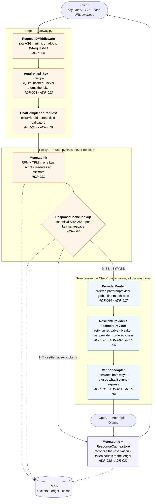

# Architecture

One request's journey through the gateway, and why each stop exists.

Every box below is a decision with an ADR behind it, a rejected alternative, and
a condition under which the rejected alternative wins. If a box cannot answer
those three things it should not be a box.

## The request path

A streaming request takes the same path with two differences: the cache reports
`BYPASS` without looking (ADR-004), and settlement moves into the SSE
generator's `finally`, because a stream's cost is only known once it has ended —
and it has three endings (ADR-019).

## Box by box

### 1. `RequestIDMiddleware` — ADR-008

**Does.** Adopts an inbound `X-Request-ID` or mints a UUID, binds it into
structlog's context vars, echoes it back, and writes one `request completed`
line with method, path, status and duration.

**Defends.** Raw ASGI rather than Starlette's `BaseHTTPMiddleware`, which wraps
the response in a task and breaks streaming. Context vars rather than threading
an ID through every call site, so a log line written four layers down carries it
without anyone passing it. Adopting the inbound header is what makes a trace
survive the hop *into* this service — a gateway that mints a fresh ID per
request is the point where distributed tracing stops.

**Rejected.** Stdlib logging with a text format; OpenTelemetry now. OTel wins
once there are spans worth nesting rather than one correlation ID, and it can
reuse this ID as trace context.

### 2. `require_api_key` → `Principal` — ADR-003, ADR-013

**Does.** Checks `Authorization: Bearer`, and returns an *identity* — never a
token. `key_id` is the public half of a SHA-256-hashed key in SQLite, minted by
the `vortex-keys` CLI.

**Defends.** Everything downstream is keyed on `key_id`: the Redis bucket, the
ledger row, the cache namespace, the log field. That is precisely why it must
not be the secret. SHA-256 rather than bcrypt or argon2 — a work factor makes
*guessable* secrets expensive to guess, and there is no dictionary behind 32
CSPRNG bytes, so it would buy nothing and cost ~100 ms of CPU per request.
Declared on the `APIRouter`, not per route, so a route added later cannot be
published unauthenticated by omission. A configured key store *replaces* the
`VORTEX_API_KEYS` list rather than merging with it: two allow-lists means
revoking from one and still being let in by the other.

**Rejected.** A `POST /v1/keys` endpoint — creating the first credential over an
API that requires one is a bootstrap problem, and the usual answer (an admin
route behind a bootstrap secret) is the plaintext env key wearing a hat.
Postgres wins the day a second node needs the same keys; same schema, same
hash, which is why the store is a class rather than a module of functions.

### 3. `ChatCompletionRequest` — ADR-009, ADR-010

**Does.** Validates the whole request in provider-neutral terms before any
provider is chosen: `extra="forbid"`, plus the cross-field checks no single
field can make — conflicting token limits, `top_logprobs` without `logprobs`, a
forced tool that was never declared, a tool result answering no call.

**Defends.** The contract is OpenAI's chat-completions shape, so every existing
SDK works by changing one base URL — that is the entire adoption argument, and
it is worth inheriting OpenAI's warts for. `extra="forbid"` means `temperture`
is a `400` naming the key rather than a request that quietly did something else;
the alternative bills the caller for an answer to a question they did not ask
and surfaces as a quality complaint weeks later.

**Rejected.** A cleaner bespoke schema (wins if this ever stops being a drop-in
replacement); the intersection of all three vendors (loses — the intersection
has no tool calling, which is most of the value).

### 4. `Meter.admit` — ADR-021

**Does.** Reserves one request and an estimated token count against the caller's
per-minute buckets, in a single Lua script, before anything upstream is touched.
Attaches the `X-RateLimit-*` sextet to the response either way.

**Defends.** One script because *both* allowances must fit or neither is spent:
with three round trips, a request the token bucket refuses has already burned a
request. A token bucket rather than a per-minute `INCR`, which admits twice the
limit across the minute boundary. TPM is a limit on a number that does not exist
yet, so admission reserves a deliberately crude estimate and settlement
reconciles it — which makes the estimate's *accuracy* nearly irrelevant, since
it governs what a caller may have in flight rather than what they are charged.
Headers on success as well as rejection, because a client that only learns its
remaining allowance by exceeding it can only back off after being throttled.

**Fails open.** A Redis outage produces one warning and an admitted request. A
limiter that takes the service down when it cannot enforce a limit has inverted
its own purpose — and Redis is deliberately *not* a readiness check, because
draining a working instance over a degraded limiter turns a degradation into an
outage. The rejected option — fail closed, loudly — wins the day these limits
become a contractual quota rather than a protection.

### 5. `ResponseCache.lookup` — ADR-004

**Does.** Hashes the *validated* request — `model_dump(mode="json")`, sorted
keys, compact separators, SHA-256 — and answers `HIT`, `MISS` or `BYPASS` in the
`X-Cache` header. Entries are namespaced by `key_id` and TTL'd per route.

**Defends.** Hashing the validated model rather than the raw body means a client
library's JSON key order is not part of the cache key, and an omitted parameter
hashes as its default. Exactly four fields are excluded — `stream`,
`stream_options`, `user`, `metadata` — because nothing else is provably unable
to change a generated token. Per-key namespacing because an exact hit returns a
completion generated under, and billed to, another tenant's key;
`VORTEX_CACHE_SCOPE=global` opts a single-tenant deployment back into the shared
hit rate. It sits *below* the limiter so a hit still costs a request — a cache
above it would be a rate limit anyone able to repeat themselves could walk
around — and a hit settles at **zero tokens**, because recording the cached
response's usage would put spend in the ledger against an invoice line that does
not exist.

**Rejected.** Similarity matching (that is ADR-005, and it needs an embedding
model and a threshold); caching streams. Two of a stream's three endings produce
a partial answer that must never be stored, so caching one means teaching the
cache the ending taxonomy `streaming.py` owns — the rejected option wins as soon
as streams dominate traffic and repeat, and then the rule is "store on the
completed ending only".

### 6. `ProviderRouter` — ADR-016, ADR-017

**Does.** Maps a model name onto a provider through an ordered
`pattern=provider` glob table read from the environment at boot. First match
wins. It is itself a `ChatProvider`.

**Defends.** Being a `ChatProvider` is the load-bearing part: `create_app`
mounts a router exactly where it would mount a single adapter, so routing
composes through the existing seam instead of sitting beside it. Order is what
makes the table expressive — a specific rule before a general one carves an
exception out of it, which a dict cannot express and a regex only expresses
obscurely. The table is also the enable list: a provider no rule names is never
constructed, a named provider missing its key fails at *startup*, and an
unclaimed model is a `404` rather than a surprise bill on whichever provider
happened to be first.

**Rejected.** An embedded config database. LiteLLM — the closest prior art —
ships YAML and only reaches for a database when day-2 edits must land without a
restart, and then reaches for Postgres, not an embedded file, because a
per-replica file gives every replica its own private routing table. When runtime
mutation is genuinely needed here the store is Redis, and it is a change to
`build_router` alone.

### 7. `ResilientProvider` / `FallbackProvider` — ADR-001, ADR-002, ADR-020

**Does.** Wraps every adapter, before the router ever sees it, in its own retry
loop and its own circuit breaker; `FallbackProvider` tries an ordered chain.
`router.providers` holds wrappers, not adapters — reach the adapter through
`.inner`.

**Defends.** Retries branch on `ProviderError.retryable`, read as an attribute
and never re-derived, so a reclassification is one line with a test on it.
Backoff is *full* jitter — uniform over `[0, base·2ⁿ]`, not base-plus-noise —
because deterministic backoff re-synchronises every client that failed together
into a herd. A wall-clock deadline covers the whole sequence and must exceed the
per-attempt timeout, or the first slow failure spends the entire budget and
`max_attempts` silently means one. One breaker *per provider*, because a shared
breaker would let a dead OpenAI refuse Anthropic traffic, which is the opposite
of what a multi-provider gateway is for; failures are counted per request, not
per attempt, so the threshold means what it says; a `ProviderBadRequest` never
moves it, or one client sending garbage could take a provider offline for
everyone. Fallback hops only on `CircuitOpenError` or exhausted retries — never
on a `400`, which would fail everywhere and spend a second provider's quota to
return the same error more slowly.

**Rejected.** Automatic failover on any error. Also deliberately not built:
per-hop model rewriting, which needs syntax; and `UnsupportedParameterError` is
*not* hopped even though another provider would genuinely succeed, because
rescuing it silently changes which model answers a request that named one.

### 8. Vendor adapter — ADR-011, ADR-014, ADR-015

**Does.** Translates the unified contract to one vendor's format and back,
raises a typed `ProviderError` on failure, and never builds an HTTP status.

**Defends.** The seam is a two-method `Protocol` (`complete`, `stream`), so
adapters are structurally typed with no base class to inherit, and it existed
before the first real adapter — otherwise it would have been shaped by whichever
vendor was integrated first. Translation refuses rather than drops: `n`, `seed`,
`logprobs`, `logit_bias`, the penalties and a forced `tool_choice` raise where
the vendor has no equivalent, because a silently dropped parameter is a
behaviour change the caller cannot see in a well-formed response. Deliberately
asymmetric — *responses* are lenient and skip content blocks we do not model,
since an additive block should not cost the caller their answer. Failures are
classified **once**, in the shared HTTP base, so three adapters cannot disagree
about whether a `529` is retryable.

**Rejected.** Letting httpx exceptions escape for each consumer to classify;
narrowing the contract to what all three vendors share.

### 9. `Meter.settle` + `ResponseCache.store` — ADR-018, ADR-022

**Does.** Reconciles the reservation against real usage, writes token counts to
the per-key ledger, and stores the completion for next time.

**Defends.** The ledger stores **tokens, not money**: integers are exact under
`HINCRBY`, they are what a vendor itemises, and a corrected price reprices the
whole history rather than needing a migration. An unpriced model reports `None`,
never zero — a new model silently costing nothing is how it gets rolled out and
billed to nobody. On streams the gateway asks every provider for usage
regardless of what the caller requested and strips the chunk back out when they
did not ask, because it is the party being billed; a request whose usage never
arrives is recorded as *unmetered* — counted, published separately, never
reported as free.

**Rejected.** Storing dollars as floats (cannot represent $2.50/M, and the sum
is nearly the invoice — close enough that nobody checks it, different enough to
argue about) or as integer nano-USD (exact, and still frozen at the wrong
price). Storing both wins the day prices must be frozen per request for audit.

## What is deliberately *not* on the path

- **`/healthz` and `/readyz`** live on the app, not the `/v1` router, so they
  stay unauthenticated. Liveness checks nothing external — a dependency outage
  must never make an orchestrator restart a healthy process (ADR-006).
- **Redis** is not a readiness check. Everything that uses it degrades rather
  than fails, and draining a working instance over a degraded limiter turns a
  degradation into an outage (ADR-021).
- **`vortex-keys`** talks to the SQLite file directly and never to the running
  gateway. Minting a credential is an operator action (ADR-003).
- **`GET /v1/usage`** is the read side of the ledger, not part of serving a
  completion. It answers only about the calling key: a report that can name
  another key is an authorisation system, and there isn't one.

## Where state lives

| State | Home | Lifetime | Shared across workers |
|---|---|---|---|
| API keys | SQLite, hashed | until revoked | one file, one node |
| Rate-limit buckets | Redis `vortex:rl:<key_id>:{requests,tokens}` | 2 minutes idle | yes |
| Usage ledger | Redis `vortex:usage:<key_id>:<YYYY-MM-DD>` | `VORTEX_USAGE_RETENTION_DAYS` | yes |
| Cache entries | Redis `vortex:cache:<scope>:<path>:<sha256>` | per-route TTL | yes |
| Breaker state | process memory | process | **no** |
| Cache counters | process memory | process | **no** |

The two "no"s are the same known limitation: with N workers the fleet needs
N×threshold failures to protect itself and runs N probe schedules, and a hit
rate is per worker. Both move to Redis on the same day, with a timeout and a
fail-open policy — or the thing protecting us becomes the thing that takes us
down.

## The three ways a request ends

| Ending | Buffered | Streamed |
|---|---|---|
| Success | `200` + envelope, settled with real usage | chunks, `[DONE]`, settled in the generator's `finally` |
| Provider failure | `502`/`504`/`429`… + error envelope, reservation released in full | the `200` is already on the wire, so the error is one final SSE event before `[DONE]` |
| Client hangs up | nothing to do | cancellation is recorded, re-raised into the provider's generator to close the upstream, and settled as *unmetered* on a spawned task — because the scope is already cancelled and awaiting Redis there loses precisely the settlement that matters (ADR-019) |

## Reading order

`docs/adr/README.md` is the index. For the path above, the shortest route to
understanding it is ADR-009 (the contract), ADR-011 (the seam), ADR-015 (the
failure taxonomy), then anything that interests you — every other decision hangs
off those three.
